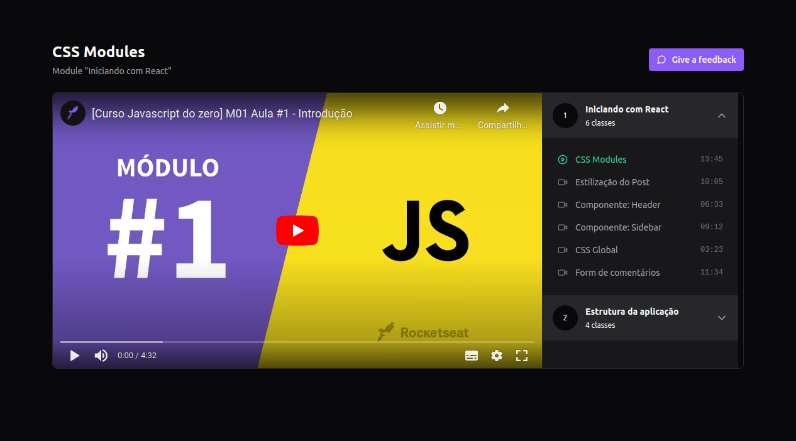

<div style="text-align: center;">
  
     
</div>

<div style="text-align: center;">
  <a href="#memo-project">Project</a>&nbsp;&nbsp;&nbsp;|&nbsp;&nbsp;&nbsp;
  <a href="#rocket-technologies">Technologies</a>&nbsp;&nbsp;&nbsp;|&nbsp;&nbsp;&nbsp;
  <a href="#clipboard-requirements">Requirements</a>&nbsp;&nbsp;&nbsp;|&nbsp;&nbsp;&nbsp;
  <a href="#keyboard-how-to-run-the-project ">How to run the project </a>&nbsp;&nbsp;&nbsp;|&nbsp;&nbsp;&nbsp;
</div>
<br>

---

## :memo: Project 

In this course, we explored the fundamentals of Redux, a popular library for state management in JavaScript applications. Additionally, we discussed some alternatives to Redux and understood how the Flux architecture works.

During the course, we created a project using Vite and set up Redux using Redux Toolkit, sharing the store throughout the application. we learned how to perform a dispatch in Redux, which is the process of triggering an action to update the application's state. Moreover, we integrated the Redux store with TypeScript, leveraging the benefits of static typing provided by this language. The course also covered the Redux DevTools extension for the browser, enhancing our development experience with Redux.

we installed and configured Tailwind CSS to start developing the application's interface and set up the json-server package to generate a fake API to receive requests.

Furthermore, we explored the functionality of Async Thunk in Redux Toolkit to create asynchronous reducers. we learned to utilize the Redux Toolkit's features to handle asynchronous operations, such as API calls, and efficiently implement asynchronous reducers. Additionally, we added the "isLoading" field to the store, which allowed we to display a loading state in the interface, and also I took the challenge of creating a skeleton loading screen using Tailwind CSS.

In the later part of the course, we installed Zustand and began migrating from Redux to this library. Finally, we created tests for the Zustand store, just as we did previously for Redux, concluding the project.


This is a project developed during React bootcamp **[Ignite](https://github.com/Rocketseat)**, run by **[@Rocketseat](https://github.com/Rocketseat)**.

<br>

---

## :rocket: Technologies ##

This project was developed using the following technologies:

- [React](https://pt-br.reactjs.org/)
- [TypeScript](https://www.typescriptlang.org/)
- [Vite](https://vitejs.dev/)
- [Vitest](https://vitest.dev/)
- [Json Server](https://www.npmjs.com/package/json-server)
- [Redux](https://redux.js.org/)
- [Redux toolkit](https://redux-toolkit.js.org/)
- [Zustand](https://github.com/pmndrs/zustand)
- [Tailwindcss](https://tailwindcss.com/)
- [Lucide React](https://lucide.dev/guide/packages/lucide-react)

<br>

---

## :clipboard: Requirements

Before starting you need :checkered_flag:, have installed the [Git](https://git-scm.com) e [Node](https://nodejs.org/en/).

<br>

---
## :keyboard: How to run the project ##

```bash
# Clone this project
$ git clone git@github.com:Ca-byte/react_redux_zustand.git

# Access
$ cd react-redux-zustand

# Install dependencies
$ npm i

# Run the project
$ npm run dev

# Run the server
$ npm run server

# Run the tests
$ npm run text 
$ npm run test:watch


# The server will initialize in the <http://localhost:5173/>

```
<br>

---

<a href="#top">☝</a>

<p style="text-align: center;">Developed with 💜 by Caroline Vieira</p>

